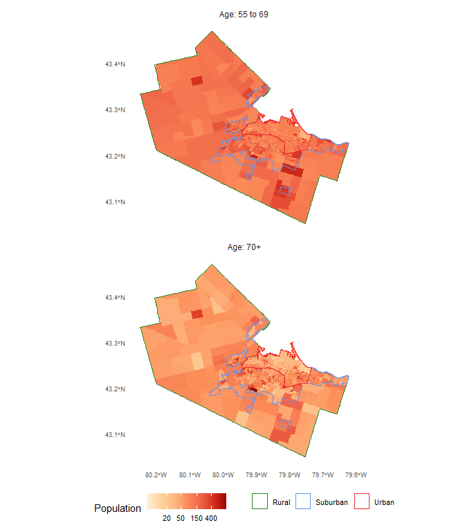

<!-- README.md is generated from README.Rmd. Please edit that file -->

# An examination of the accessibility implications of a pilot COVID-19 vaccination program in Hamilton, Ontario

<!-- badges: start -->

<!-- badges: end -->

Antonio Páez (McMaster University)  
Christopher D. Higgins (University of Toronto Scarborough)

Paper submitted to *Transport Findings*

## Abstract

The Government of Ontario in Canada announced the pilot for a new
vaccination program, with designated pharmacies across the province now
able to offer COVID-19 vaccines. The accessibility of this program
raises questions about the cost of travel and the distribution of the
cost among the population. In our examination of the City of Hamilton we
find that selected sites do not serve well rural and urban residents and
that the associated cost of travel is expected to be disproportionally
borne by lower income populations. Modest additions to the list of pilot
sites in the city can substantially alleviate this inequity.

## Keywords

  - COVID-19  
  - Vaccination sites
  - Accessibility  
  - Hamilton  
  - Ontario
  - Reproducible research

## Questions

Along with the provision of health care facilities to treat severe cases
of COVID-19 (Pereira, Braga, et al. 2021), another front in the fight
against the pandemic is the rolling out of vaccination programs. The
Government of Ontario, in Canada, announced on April 1st 2021 the
expansion of a [pilot
program](https://www.cbc.ca/news/canada/hamilton/astrazeneca-vaccine-hamilton-1.5972704)
to offer vaccines in pharmacies in the City of Hamilton. This program is
in addition to dedicated vaccination centers for people aged 70+. Twenty
pharmacies in Hamilton were added to an earlier list of 325 locations in
other cities across the province, and the program was extended to people
aged 55 years old and over.

[Critics](https://twitter.com/RyanMcGreal/status/1378027149790224386?s=20)
were swift to point out that the list of pharmacies approved for
Hamilton by the province were mostly located in [lower
density](https://twitter.com/NrinderWard3/status/1378679195514060801?s=20)
parts of the city that are not well serviced by transit and are
difficult to reach by foot. Indeed, as seen in Figure 1, a vast majority
of the pharmacies are in suburban Hamilton. The issue is less clear-cut
when we consider that Hamilton’s older population skews suburban (see
Figure 2). Given the target demographic for the program, it is possible
that suburban sites could be convenient for mature adults and the young
old: the population aged 55 to 69 in Hamilton is approximately 58,710
suburban, 35,490 urban, and only 8,360 rural. Nevertheless, the
selection of sites by the province raises some important questions and
the decision-making process to select these sites appears to have been
opaque, with the Mayor of the city caught [flat
footed](https://twitter.com/FredEisenberger/status/1378350123114242053?s=20)
by the announcement. As Yu et al. (2021) note, good geographical
coverage is a key element for a successful vaccination campaign; at the
same time, siting vaccinations sites in car-oriented locations may lead
to inequities in access.

In this research, we investigate the accessibility implications of the
sites selected for the pilot vaccination program. Concretely, we ask:

  - What is the estimated cost of travel to reach the vaccination sites,
    assuming that every person requires a vaccine?
  - What is the distribution of this cost across the population of the
    city?
  - How does the cost and its distribution change with the addition of
    candidate sites in urban Hamilton?

We concentrate on the 55 to 69 years old population segment because the
older 70+ group have access to other dedicated facilities besides those
in the provincial pilot.

Figure 1. Regions with the City of Hamilton; the location of pharmacies
in pilot is shown (black triangles) along with urban locations for
scenario analysis (white circles).

Figure 2. Distribution of population aged 55+ in the City of Hamilton.

## Methods

We use data from the following sources.

  - Urban, suburban, and rural boundary definitions from the [City of
    Hamilton](https://open.hamilton.ca/)
  - Population and median total household income for 2016 by
    Dissemination Area (DA) boundary using the `cancensus` package (von
    Bergmann, Shkolnik, and Jacobs 2021)
  - Modal split by age for traffic analysis zones (TAZ) from the 2016
    Transportation Tomorrow Survey ([TTS](http://dmg.utoronto.ca/))
  - Locations of pilot pharmacies from public records
  - Locations of three additional major chain pharmacies for scenario
    testing
  - Residential units by land parcel

Using the population aged 55 to 59 y.o. we first calculate the average
number of people per dwelling and assign them proportionally to the
dwellings by parcel. Second, median incomes and modal splits across
walking, transit, and car are joined to the parcels. Although our data
are from 2016 (the most recent available), we assume they are largely
representative of current spatial and demographic trends in the city.
Third, we use the `r5r` (Pereira, Saraiva, et al. 2021) package to
calculate the travel time from each parcel to all pharmacies by three
modes using a cutoff value of 180 min and a maximum walking distance of
10,000 m. Once we obtained travel time tables with population,
proportion of trips by mode, and income information, we calculated the
expected travel time  from each parcel 
to a pharmacy  as
follows:   
 + p^t_i \\min(tt^t_{ij}) + p^w_i \\min(tt^w_{ij})
")  
where  is
the proportion of trips by mode
 in the TAZ of parcel
, and
 is the vector of travel times from parcel
 to the pharmacies. The
expected travel time is thus the weighted sum of travel times to the
nearest pharmacy, with the weights given by the expected modal split in
the TAZ.

The expected travel time  was multiplied by the assigned population in parcel
 to obtain a measure of
person-hours of travel () as follows:   
  

Please note that this paper is a reproducible research document (see
Brunsdon and Comber 2020) conducted using open source tools for
transportation analysis (Lovelace 2021). The code and data necessary to
reproduce the analysis are available in a [public
repository](https://github.com/paezha/Accessibility-Pharmacies-Hamilton-Vaccines).

## Findings

The top panel of Figure 3 shows the average expected use-weighted
multi-modal travel times by TAZ in Hamilton. It is apparent that travel
times tend to be lower in much of suburban Hamilton and higher in the
urban core and some rural parts of the city, particularly to the west.
This is unsurprising, given the higher probability of travel by car and
the predominantly suburban character of the vaccination sites. However,
even accounting for the distribution of population, this leads to large
disparities in the number of person-hours of travel across the city,
with a concentration of the burden of travel in the urban core and the
rural west (see bottom panel of Figure 3).

The disparities are not trivial.

As seen in Table 1, under the pilot program approximately 36.42% of
people live in DAs in the bottom 40% of the median household income
scale, but they account for 51.98% of the total person-hours of travel.
In contrast, 44.5% of people aged 55 to 69 in DAs in the top 40% of the
median household income scale accrue only 35.03% of the total
person-hours of travel. Where the mean travel time of residents of DAs
with high median household income is 6 minutes, residents of lower
income DAs average 12 minutes in travel time. In addition to longer
average travel time, residents in lower income DAs also see
substantially larger variations in travel times, and some may face
considerably longer travel times (see top-left panel in Figure 4).

There are also important disparities by region. As shown in Table 1, the
urban and rural populations in Hamilton are approximately 42.75% of the
population but they bear 69.25% of the total person-hours of travel,
with also much greater variability in expected travel times (Figure 4,
bottom-left panel).

For comparison purposes we consider a scenario with some modest
additions to the list of pharmacies in the provincial pilot. We repeat
the analysis, but include the three urban sites shown in white circles
in Figure 1. The results of this scenario appear in the last two columns
of Table 1 and the two right panels of Figure 4. While all income groups
benefit from the addition of these three sites with shorter mean trip
durations, the most remarkable difference is the large reduction in the
disparities between residents in DAs with lower levels of income. The
top-right panel of Figure 4 shows that the distribution of expected
travel time is now more in line for all income groups, even if the
bottom two income quintiles still have somewhat wider spreads.
Unsurprisingly, the addition of three urban vaccination sites does not
have a large impact for rural residents.

The results indicate that the locations chosen by the province for the
pilot vaccination program do not serve well urban or rural residents of
the city, and there are some important questions regarding equity of
access to the program, with a disproportionate burden in the cost of
travel falling on lower income urban populations and rural populations.
Selection of three sensible urban locations does much to alleviate
disparities in the burden of transportation. On the other hand, because
there are not many candidate locations in rural parts of the city,
increasing access for residents there likely necessitates an expansion
of the existing mobile vaccination pop-up clinic program.

Figure 3. Average expected travel time by TAZ (in minutes) and total
person-hours of travel by TAZ.

Figure 4. Distribution of expected travel time for different population
groups.

## References

Brunsdon, Chris, and Alexis Comber. 2020. “Opening Practice: Supporting
Reproducibility and Critical Spatial Data Science.” *Journal of
Geographical Systems*, 1–20.
<https://doi.org/10.1007/s10109-020-00334-2>.

Lovelace, Robin. 2021. “Open Source Tools for Geographic Analysis in
Transport Planning.” Journal Article. *Journal of Geographical Systems*.
<https://doi.org/10.1007/s10109-020-00342-2>.

Pereira, Rafael H. M., Carlos K. V. S. Braga, L. Mendes and Serra, P. B.
Amaral, N. Gouveia, and A. Paez. 2021. “Geographic Access to Covid-19
Healthcare in Brazil Using a Balanced Float Catchment Area Approach.”
Journal Article. *Social Science & Medicine* 273: 113773.
<https://doi.org/https://doi.org/10.1016/j.socscimed.2021.113773>.

Pereira, Rafael H. M., Marcus Saraiva, Daniel Herszenhut, Carlos Kaue
Vieira Braga, and Matthew Wigginton Conway. 2021. “R5r: Rapid Realistic
Routing on Multimodal Transport Networks with R5 in R.”
*Findings*, March. <https://doi.org/10.32866/001c.21262>.

von Bergmann, Jens, Dmitry Shkolnik, and Aaron Jacobs. 2021. *Cancensus:
R Package to Access, Retrieve, and Work with Canadian Census Data and
Geography*. <https://mountainmath.github.io/cancensus/>.

Yu, J. H., H. J. Jeong, S. J. Kim, J. Y. Lee, Y. J. Choe, E. H. Choi,
and E. H. Cho. 2021. “Sustained Vaccination Coverage During the
Coronavirus Disease 2019 Epidemic in the Republic of Korea.” Journal
Article. *Vaccines* 9 (1): 8. <https://doi.org/10.3390/vaccines9010002>.

