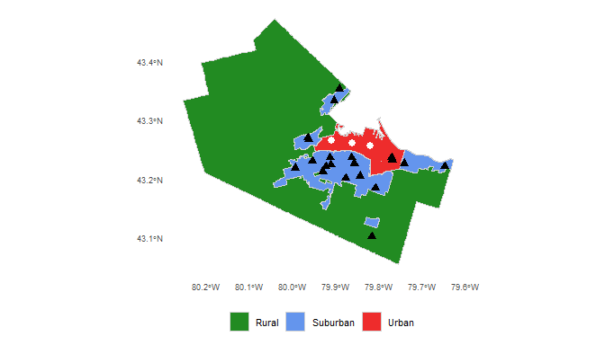

<!-- README.md is generated from README.Rmd. Please edit that file -->

# An examination of the accessibility implications of a pilot COVID-19 vaccination program in Hamilton, Ontario

<!-- badges: start -->
<!-- badges: end -->

Antonio Páez (McMaster University)  
Christopher D. Higgins (University of Toronto Scarborough)

Findings (2020) <https://doi.org/10.32866/001c.24082>

## Abstract

The Government of Ontario in Canada announced the pilot for a new
vaccination program, with designated pharmacies across the province now
able to offer COVID-19 vaccines. The accessibility of this program
raises questions about travel times to vaccination sites and the
distribution of these times among the population. In our examination of
the City of Hamilton we find that selected sites do not serve rural and
urban residents well; particularly, the associated cost of travel (in
terms of travel time) is expected to be disproportionally borne by lower
income urban populations and rural residents. Modest additions to the
list of pilot sites in the city can substantially alleviate this
inequity.

## Keywords

-   COVID-19  
-   Vaccination sites
-   Accessibility  
-   Hamilton  
-   Ontario
-   Reproducible research

# Questions

Along with the provision of health care facilities to treat severe cases
of COVID-19 (e.g., Ghorbanzadeh et al. 2021; Pereira, Braga, et al.
2021), another front in the fight against the pandemic is the rolling
out of vaccination programs. The Government of Ontario, in Canada,
implemented a pilot program to offer vaccines in pharmacies for people
60 years and older in early 2021. In the first incarnation of this
program, the province approved 325 pharmacies in Toronto, Windsor-Essex,
and Kingston (the latter including the region of Frontenac-Lennox and
Addington). The City of Hamilton, the third most populous urban center
in the province, operated dedicated vaccination centers for people aged
70+ and mobile pop-up clinics for people aged 75+; however, it did not
have any approved pharmacies under the pilot for other populations until
April 1st 2021, with the announcement of 20 pharmacies in the city . At
the same time that the expansion of the pilot was announced, the
province extended eligibility for this program to people 55 years and
older.

Critics were swift to point out that the list of pharmacies approved for
Hamilton by the province were mostly located in lower density parts of
the city that are not well serviced by transit and are difficult to
reach by foot. Indeed, as seen in Figure , a vast majority of the
pharmacies are in suburban Hamilton. Whether this is an issue is less
clear-cut when we consider that Hamilton’s older population skews
suburban (see Figure ). Given the target demographic for the program, it
is possible that suburban sites could be convenient for mature adults
and the young old: the population aged 55 to 69 in Hamilton is
approximately 58,710 suburban, 35,490 urban, and only 8,360 rural.
Nevertheless, the selection of sites by the province raised some
important questions. As Yu et al. (2021) note, good geographical
coverage is a key element for a successful vaccination campaign; at the
same time, siting vaccinations sites in car-oriented locations may lead
to inequities in access by requiring people who do not own cars or who
typically travel by other modes (mostly lower income urban residents) to
spend more of their time reaching an approved pharmacy.

In this research, we investigate the accessibility implications of the
sites selected for the pilot vaccination program. Concretely, we ask:

-   What is the estimated travel time needed to reach the nearest
    approved pharmacy, assuming that every person requires a vaccine?
-   What is the distribution of travel times across the population of
    the city?
-   How does the cost of time needed for travel and its distribution
    change with the addition of candidate vaccination sites in urban
    Hamilton?

We concentrate on the 55 to 69 year old population segment because the
older 70+ group have access to other dedicated facilities besides those
in the provincial pharmacy pilot (including pop-up clinics for people
75+).

Regions with the City of Hamilton; the location of pharmacies in pilot
is shown (black triangles) along with urban locations for scenario
analysis (white circles).

Distribution of population aged 55+ in the City of Hamilton.

# Methods

We use data from the following sources.

-   Urban, suburban, and rural boundary definitions from the City of
    Hamilton
-   Population and median total household income for 2016 by
    Dissemination Area (DA) boundary using the `cancensus` package (von
    Bergmann, Shkolnik, and Jacobs 2021)
-   Modal split by age for traffic analysis zones (TAZ) from the 2016
    Transportation Tomorrow Survey (TTS)
-   Locations of pilot pharmacies from public records
-   Locations of three additional major chain pharmacies for scenario
    testing
-   Residential units by land parcel

Using the population aged 55 to 69 y.o. we first calculate the average
number of people per dwelling and assign them proportionally to the
dwellings by parcel. Second, median household incomes and modal splits
across walking, transit, and car are joined to the parcels. Our data are
from 2016 (the most recent available), but we assume they are largely
representative of spatial, mobility, and demographic trends in the city.
In the absence of travel behavior information during the pandemic we
suggest this is an inevitable limitation of the analysis. Third, we use
the `r5r` (Pereira, Saraiva, et al. 2021) package to calculate the
travel time from each parcel to all pharmacies by three modes using a
cutoff value of 180 min and a maximum walking distance of 10,000 m.
These thresholds are chosen to maximize the coverage of the travel time
tables, but the analysis, as explained next, is based on travel to the
nearest approved pharmacy. Once we obtained travel time tables with
population, proportion of trips by mode, and income information, we
calculated the expected travel time
 from each parcel
 to a pharmacy
 as follows:

 + p^t_i \min(tt^t_{ij}) + p^w_i \min(tt^w_{ij})
")

where  is
the proportion of trips by mode
 in the TAZ of parcel
, and

is the vector of travel times from parcel
 to the pharmacies. The
expected travel time is thus the weighted sum of travel times to the
*nearest* pharmacy, with the weights given by the expected modal split
in the TAZ.

The expected travel time
 was multiplied by the
assigned population in parcel
 to obtain a measure of
person-hours of travel
() that gives a
cumulative cost (in travel time) for a population group. This is as
follows:

Please note that this paper is a reproducible research document (see
Brunsdon and Comber 2020) conducted using open source tools for
transportation analysis (Lovelace 2021). The code and data necessary to
reproduce the analysis are available in a public repository.

# Findings

The top panel of Figure shows the average multimodal travel times
(weighted by modal shares) by TAZ in Hamilton. It is apparent that
travel times tend to be lower in much of suburban Hamilton and higher in
the urban core and some rural parts of the city, particularly to the
west. This is unsurprising, given the higher probability of travel by
car and the predominantly suburban character of the vaccination sites.
However, even accounting for the distribution of population, this leads
to large disparities in the number of person-hours of travel across the
city, with a concentration of the burden of travel in the urban core and
the rural west (see bottom panel of Figure ).

The disparities are not trivial.

As seen in Table , under the pilot program approximately 36.42% of
people live in DAs in the bottom 40% of the median household income
scale, but they account for 51.98% of the total person-hours of travel.
In contrast, 44.5% of people aged 55 to 69 in DAs in the top 40% of the
median household income scale accrue only 35.03% of the total
person-hours of travel. Where the mean travel time of residents of DAs
with high median household income is 347 minutes, residents of lower
income DAs average 746 minutes in travel time. In addition to greater
average travel times, the top-left panel in Figure suggests residents in
lower income DAs also see substantially larger variability in travel
times and some may face considerably longer trip durations.

There are also important disparities by region. As shown in Table , the
urban and rural populations in Hamilton are approximately 42.75% of the
population but they bear 69.25% of the total person-hours of travel,
with also much greater variability in expected travel times (Figure ,
bottom-left panel).

For comparison purposes we consider a scenario with some modest
additions to the list of pharmacies in the provincial pilot. For the
scenario we choose three plausible sites (i.e., pharmacies that belong
to chains already used by the province for this program). We do not
conduct a systematic search of candidate locations. We note that some
papers propound the design of optimal accessibility landscapes (e.g.,
Horner 2008; Páez et al. 2013), but such an endeavor is beyond the scope
of a short findings paper. Instead, we repeat the analysis after
including the three urban sites shown in white circles in Figure .

The results of this scenario appear in the last two columns of Table and
the two right panels of Figure . While all income groups benefit from
the addition of these three sites with shorter mean trip durations, the
most remarkable difference is the large reduction in the disparities
between residents in DAs with lower levels of income. The top-right
panel of Figure shows that the distribution of expected travel time is
now more in line for all income groups, even if the bottom two income
quintiles still have somewhat wider spreads. Unsurprisingly, the
addition of three urban vaccination sites does not have a large impact
for rural residents. The scenario also suggests that important
reductions in the need for travel can be achieved. While this is true
for all three modes of transportation (see Table ), the reductions are
more substantial for travel by transit and walking. At a time that
non-pharmaceutical interventions call for reductions in mobility, it is
clearly in the public interest to reduce the need to travel even for
this essential purpose.

The results indicate that the locations chosen by the province for the
pilot vaccination program do not serve urban or rural residents of the
city well, and there are some important questions regarding equity of
access to the program. As shown, a disproportionate burden in the cost
of travel (in terms of travel time) falls on lower income urban
populations and rural populations. The selection of three sensible urban
locations does much to alleviate disparities in the burden of
transportation - and the fact that this is so despite the lack of a
systematic search for optimal locations does not speak well of the
effort put forth by the province in the choice of vaccination sites. The
situation is different for rural populations, mainly because there are
not many candidate locations in rural parts of the city; in this case,
it is likely that increasing access for residents there will necessitate
an expansion of the existing mobile vaccination pop-up clinic program.

Average expected travel time by TAZ (in minutes) and total person-hours
of travel by TAZ.

<table class="table table-striped" style="margin-left: auto; margin-right: auto;border-bottom: 0;">
<caption>
Distribution of person-hours of travel (PHT) by median total household
income and region: pilot locations only (baseline), and scenario with
three urban locations added
</caption>
<thead>
<tr>
<th style="empty-cells: hide;border-bottom:hidden;" colspan="2">
</th>
<th style="border-bottom:hidden;padding-bottom:0; padding-left:3px;padding-right:3px;text-align: center; " colspan="2">

Pilot Program

</th>
<th style="border-bottom:hidden;padding-bottom:0; padding-left:3px;padding-right:3px;text-align: center; " colspan="2">

Scenario

</th>
</tr>
<tr>
<th style="text-align:left;">
Group
</th>
<th style="text-align:center;">
Population
</th>
<th style="text-align:center;">
Total PHT
</th>
<th style="text-align:center;">
Minutes per person
</th>
<th style="text-align:center;">
Total PHT
</th>
<th style="text-align:center;">
Minutes per person
</th>
</tr>
</thead>
<tbody>
<tr grouplength="5">
<td colspan="6" style="border-bottom: 1px solid;">
<strong>Income Quintile</strong>
</td>
</tr>
<tr>
<td style="text-align:left;padding-left: 2em;" indentlevel="1">
Top 20%
</td>
<td style="text-align:center;">
23297.315
</td>
<td style="text-align:center;">
2243.86
</td>
<td style="text-align:center;">
5.78
</td>
<td style="text-align:center;">
2146.56
</td>
<td style="text-align:center;">
5.53
</td>
</tr>
<tr>
<td style="text-align:left;padding-left: 2em;" indentlevel="1">
Second 20%
</td>
<td style="text-align:center;">
22356.413
</td>
<td style="text-align:center;">
2471.95
</td>
<td style="text-align:center;">
6.63
</td>
<td style="text-align:center;">
2351.86
</td>
<td style="text-align:center;">
6.31
</td>
</tr>
<tr>
<td style="text-align:left;padding-left: 2em;" indentlevel="1">
Third 20%
</td>
<td style="text-align:center;">
19570.061
</td>
<td style="text-align:center;">
1749.50
</td>
<td style="text-align:center;">
5.36
</td>
<td style="text-align:center;">
1563.98
</td>
<td style="text-align:center;">
4.80
</td>
</tr>
<tr>
<td style="text-align:left;padding-left: 2em;" indentlevel="1">
Fourth 20%
</td>
<td style="text-align:center;">
17729.139
</td>
<td style="text-align:center;">
2928.96
</td>
<td style="text-align:center;">
9.91
</td>
<td style="text-align:center;">
1950.31
</td>
<td style="text-align:center;">
6.60
</td>
</tr>
<tr>
<td style="text-align:left;padding-left: 2em;" indentlevel="1">
Bottom 20%
</td>
<td style="text-align:center;">
19629.952
</td>
<td style="text-align:center;">
4068.55
</td>
<td style="text-align:center;">
12.44
</td>
<td style="text-align:center;">
2388.42
</td>
<td style="text-align:center;">
7.30
</td>
</tr>
<tr grouplength="3">
<td colspan="6" style="border-bottom: 1px solid;">
<strong>Region</strong>
</td>
</tr>
<tr>
<td style="text-align:left;padding-left: 2em;" indentlevel="1">
Rural
</td>
<td style="text-align:center;">
8356.963
</td>
<td style="text-align:center;">
1730.27
</td>
<td style="text-align:center;">
12.42
</td>
<td style="text-align:center;">
1730.24
</td>
<td style="text-align:center;">
12.42
</td>
</tr>
<tr>
<td style="text-align:left;padding-left: 2em;" indentlevel="1">
Suburban
</td>
<td style="text-align:center;">
58711.629
</td>
<td style="text-align:center;">
4138.48
</td>
<td style="text-align:center;">
4.23
</td>
<td style="text-align:center;">
4138.39
</td>
<td style="text-align:center;">
4.23
</td>
</tr>
<tr>
<td style="text-align:left;padding-left: 2em;" indentlevel="1">
Urban
</td>
<td style="text-align:center;">
35491.942
</td>
<td style="text-align:center;">
7588.59
</td>
<td style="text-align:center;">
12.83
</td>
<td style="text-align:center;">
4527.02
</td>
<td style="text-align:center;">
7.65
</td>
</tr>
</tbody>
<tfoot>
<tr>
<td style="padding: 0; " colspan="100%">
Note: 
</td>
</tr>
<tr>
<td style="padding: 0; " colspan="100%">
 The population totals differ due to small differences in the
classification of the regions
</td>
</tr>
</tfoot>
</table>
<table class="table table-striped" style="margin-left: auto; margin-right: auto;">
<caption>
Distribution of person-hours of travel (PHT) by mode of transportation:
pilot locations only (baseline) and scenario with three urban locations
added
</caption>
<thead>
<tr>
<th style="text-align:left;">
Mode
</th>
<th style="text-align:center;">
Baseline PHT
</th>
<th style="text-align:center;">
Scenario PHT
</th>
<th style="text-align:center;">
Reduction in PHT
</th>
</tr>
</thead>
<tbody>
<tr>
<td style="text-align:left;">
Car
</td>
<td style="text-align:center;">
8535.429
</td>
<td style="text-align:center;">
7092.220
</td>
<td style="text-align:center;">
-16.91%
</td>
</tr>
<tr>
<td style="text-align:left;">
Transit
</td>
<td style="text-align:center;">
2730.205
</td>
<td style="text-align:center;">
2107.684
</td>
<td style="text-align:center;">
-22.8%
</td>
</tr>
<tr>
<td style="text-align:left;">
Walking
</td>
<td style="text-align:center;">
2197.179
</td>
<td style="text-align:center;">
1201.223
</td>
<td style="text-align:center;">
-45.33%
</td>
</tr>
</tbody>
</table>

Distribution of expected travel time for different population groups.

# References

Brunsdon, Chris, and Alexis Comber. 2020. “Opening Practice: Supporting
Reproducibility and Critical Spatial Data Science.” *Journal of
Geographical Systems*, 1–20.
<https://doi.org/10.1007/s10109-020-00334-2>.

Ghorbanzadeh, Mahyar, Kyusik Kim, Eren Erman Ozguven, and Mark W.
Horner. 2021. “Spatial Accessibility Assessment of COVID-19 Patients to
Healthcare Facilities: A Case Study of Florida.” Journal Article.
*Travel Behaviour and Society* 24: 95–101.
https://doi.org/<https://doi.org/10.1016/j.tbs.2021.03.004>.

Horner, M. W. 2008. “’Optimal’ Accessibility Landscapes? Development of
a New Methodology for Simulating and Assessing Jobs-Housing
Relationships in Urban Regions.” Journal Article. *Urban Studies* 45
(8): 1583–1602. <https://doi.org/10.1177/0042098008091492>.

Lovelace, Robin. 2021. “Open Source Tools for Geographic Analysis in
Transport Planning.” Journal Article. *Journal of Geographical Systems*.
<https://doi.org/10.1007/s10109-020-00342-2>.

Páez, Antonio, Jarin Esita, K. Bruce Newbold, Nancy M. Heddle, and John
T. Blake. 2013. “Exploring Resource Allocation and Alternate Clinic
Accessibility Landscapes for Improved Blood Donor Turnout.” Journal
Article. *Applied Geography* 45 (0): 89–97.
https://doi.org/<http://dx.doi.org/10.1016/j.apgeog.2013.08.008>.

Pereira, Rafael H. M., Carlos K. V. S. Braga, L. Mendes and Serra, P. B.
Amaral, N. Gouveia, and A. Paez. 2021. “Geographic Access to COVID-19
Healthcare in Brazil Using a Balanced Float Catchment Area Approach.”
Journal Article. *Social Science & Medicine* 273: 113773.
https://doi.org/<https://doi.org/10.1016/j.socscimed.2021.113773>.

Pereira, Rafael H. M., Marcus Saraiva, Daniel Herszenhut, Carlos Kaue
Vieira Braga, and Matthew Wigginton Conway. 2021. “R5r: Rapid Realistic
Routing on Multimodal Transport Networks with r5 in r.”
*Findings*, March. <https://doi.org/10.32866/001c.21262>.

von Bergmann, Jens, Dmitry Shkolnik, and Aaron Jacobs. 2021. *Cancensus:
R Package to Access, Retrieve, and Work with Canadian Census Data and
Geography*. <https://mountainmath.github.io/cancensus/>.

Yu, J. H., H. J. Jeong, S. J. Kim, J. Y. Lee, Y. J. Choe, E. H. Choi,
and E. H. Cho. 2021. “Sustained Vaccination Coverage During the
Coronavirus Disease 2019 Epidemic in the Republic of Korea.” Journal
Article. *Vaccines* 9 (1): 8. <https://doi.org/10.3390/vaccines9010002>.

